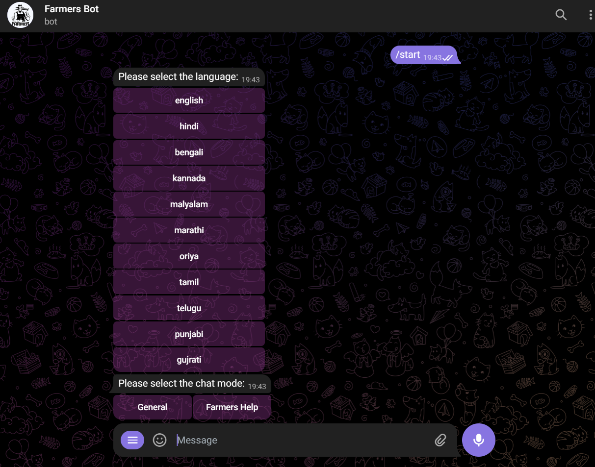

# Farmer's Bot
This is the telegram bot which can help to resolve the queries related to farming. This bot is language independent and it can generate the answer in any language (in written). It can understand and generate answer in 11 different indian languages including English and Hindi (in voice mode). \
To access it search ```Farmers2Bot``` on telegram 
## Process of Running it

since this bot is python based you should have python>=3.11 installed \
now create a new environment using anaconda or miniconda or you can skip this step
```
conda create -p env python=3.11

```
now activate the environment

```
conda activate env/

```
- copy this repo to your local computer by the command 
```
git clone https://github.com/rahim-khan-iitg/farmer_bot.git

```
now go to the farmer_bot directory
```
cd farmer_bot

```
install the required libraries

```
pip install -r requirements.txt

```
now install the src package

```
python setup.py sdist

```
```
pip install dist/src.0.0.1.tar.gz

```
now create a ```.env ``` file and specify the parameters

```
TELEGRAM_BOT_API_TOKEN=6361346727:AAHuCxUDjrxxmDJOXko-zDKGKnT4UacgJwU
BOT_USERNAME=@Farmers2Bot
BHASINI_USERID=<your user id>
BHASINI_API_KEY=<your api key>
GEMINI_API_KEY=<your api key>
QDRANT_API_KEY=<your api key>
QDRANT_ENDPOINT=<your endpoint>
QDRANT_COLLECTION_NAME=agri_qa  
MYSQL_USERNAME=<your username>
MYSQL_PASSWORD=<your password>
MYSQL_HOST=<my sql host>
MYSQL_DATABASE_NAME=<database name>
FFMPEG_ENDPOINT=http://localhost:3000/api/convertBylink
MISTRAL_API_KEY=<your api key>
MISTRAL_ENDPOINT=https://openrouter.ai/api/v1/chat/completions

```
I am using [Bhashini](https://bhashini.gov.in/ulca/user/register) Platform to convert text to speech and speech to text . \
Telegram stores all of its voice messages in ```.ogg or .oga``` format and Bhashini requires base64 encoding of  ```.mp3 or .wav``` format. so we have to convert it in the required format for that I have tried ```ffmpeg``` on windows machine but it was not working . It was working in the ```Ubuntu``` but the system was hanging a lot . So to tackle this issue I have created a next js api .  I have tried hosting it on the vercel and netlify but it wasn't working because it requires the file writting permission both of these system doesn't provide this permission so i have used it locally. it can be accessed here [link](https://github.com/rahim-khan-iitg/my-audio-converter.git). Before running this project locally converter should be running.
Now we can run our bot by using the command.
```
python main.py

```
it will run the bot using ```Gemini``` . Now we can try it in telegram app.


in text mode it support all the languages but in the voice to voice communication it support above 11 languages . When we start the bot using ``` /start ``` command it shows some settings to choose if you have already selected these settings then ignore it. and It has two modes ``` General ``` and ``` Farmers help``` select the ```General``` if you want to talk about  general issues not related to farming. Select ```Farmers Help ``` if you want specific details . But it won't work because we haven't set our knowledge base for our bot . To do it first of select a dataset from [Huggingface](http://huggingface.co/). Copy its name and now run the following file and provide this name.
```
python src/Qdrant/load.py 

```
after completion it will setup our knowledgebase , Now we can use it in Farmers help mode also. 